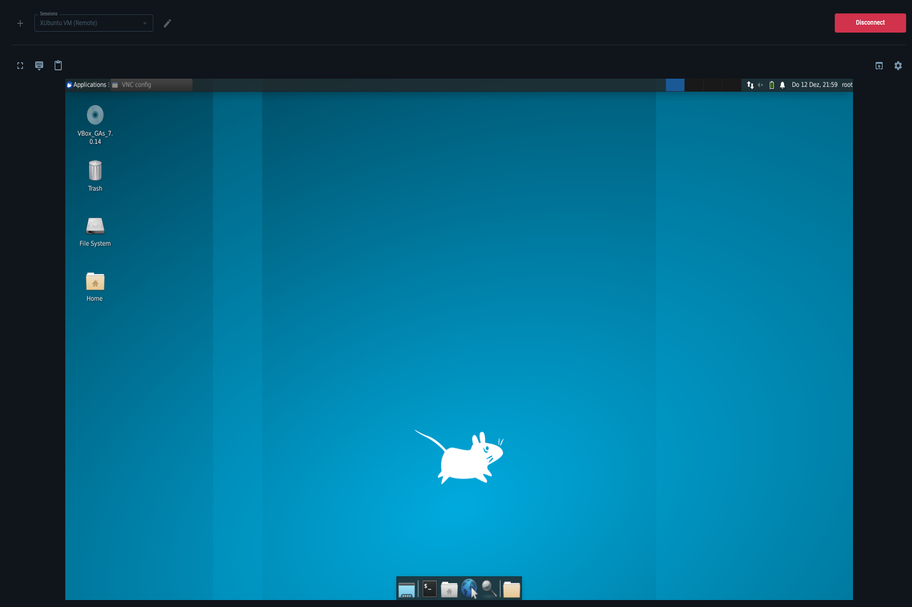

# Docker extension VNC

A VNC Viewer extension for Docker Desktop.

## Table of Contents
- [Description](#description)
- [Manual Installation](#manual-installation)
- [Usage](#usage)
  - [Example Container](#the-example-container)
  - [Sessions](#sessions)
    - [Docker Container](#docker-container)
    - [Remote Host](#remote-host)

## Description
This Docker Desktop extension is for connecting to Docker Containers or a Remote Host which have a [VNC](https://en.wikipedia.org/wiki/VNC) Server running.

The extension creates a Docker Container as a [proxy](https://hub.docker.com/r/pgmystery/proxy_vnc) for connecting to the target VNC Server and shows the view inside of Docker Desktop.

If the connection is to a Docker Container, then the extension creates a Docker Network and adds the proxy and the target container to the Network. Only this way, the proxy can access the VNC server container. After disconnect, it deletes the proxy container and removes the VNC server Container from the Network.

It uses [noVNC](https://github.com/novnc/noVNC) as the JavaScript client package.

It also comes with an example VNC Server as a docker container. So you can test things out very easily.

## Manual Installation
You can install the extension by using the command:

```shell
docker extension install pgmystery/docker-extension-vnc:1.0.0
```

## Usage

### The example Container
You can right start by seeing the possibility of this extension if you just click the button "Try example container".
It will download an [example Docker Image](https://hub.docker.com/r/pgmystery/ubuntu_vnc) with a vnc server and a Desktop installed.
It will also then automatically creates the Container and a connection to the container in the extension will be accomplished.


### Sessions
**⚠️IMPORTANT: After upgrading the extension to a new version, all Sessions getting deleted!⚠️**

To switch the target and the connection, you can create Sessions. The Session are saved in the Backend Docker Container in a SQLite Database.

To create a new Session, just click on the plus icon button.
Now you can enter the Session name, the connection type with data and optional the credentials.


This extension support 2 different kind of connections.

- [Docker Container](#docker-container)
- [Remote Host](#remote-host)

#### Docker Container
1. Select the connection type "Docker Container".
2. Select the Container from the list (if the container is not showing up, you can also manually insert the Container Name or ID).
3. Enter or select the port on which the vnc server is listening on (it is an internal port, it don't need to be exposed to the host).
4. Save the Session.
5. Click on "Connect".


#### Remote Host
1. Select the connection type "Remote Host".
2. Enter the IP of the Host you have access to.
3. Type in the port of the VNC Server on the Remote Host.
4. Save the Session.
5. Click on "Connect".


