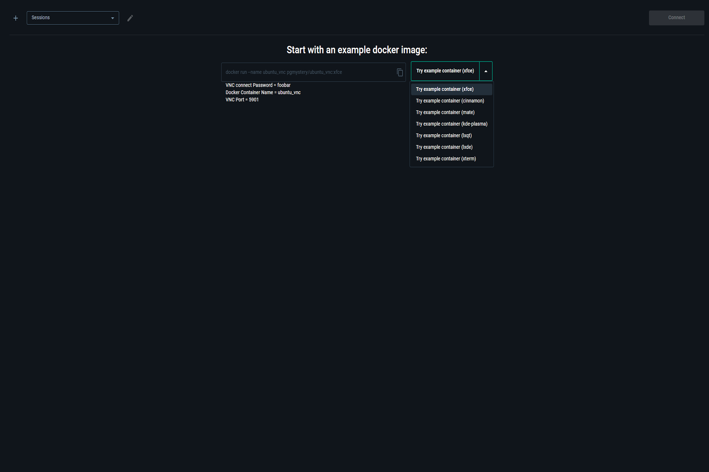

# Docker extension: [VNC Viewer](https://hub.docker.com/extensions/pgmystery/docker-extension-vnc)

A [Docker Desktop Extension](https://www.docker.com/products/extensions/) that enables you to connect to VNC servers running inside Docker containers or on remote hosts—directly from [Docker Desktop](https://www.docker.com/products/docker-desktop/).

## Table of Contents
- [Overview](#overview)
- [Installation](#installation)
  - [Install via Docker Desktop Marketplace](#install-via-docker-desktop-marketplace)
  - [Manual Installation](#manual-installation)
- [Usage](#usage)
  - [Try the Example Container](#try-the-example-container)
  - [Working with Sessions](#working-with-sessions)
    - [Connect to a Docker Container](#connect-to-a-docker-container)
    - [Run from a Docker Image](#run-from-a-docker-image)
    - [Connect to a Remote Host (Linux, Mac or Windows)](#connect-to-a-remote-host-linux-mac-or-windows)

## Overview
This Docker Desktop Extension allows you to connect to a [VNC](https://en.wikipedia.org/wiki/VNC) server running inside a Docker container or on a remote host. The extension creates a temporary Docker container that acts as a [proxy](https://hub.docker.com/r/pgmystery/proxy_vnc), using [noVNC](https://github.com/novnc/noVNC) to provide a browser-based VNC client within Docker Desktop.

Key features:
- Connect to containers, images, or remote VNC servers.
- Automatically manages Docker networking and cleanup.
- Includes [multiple pre-configured example containers](https://github.com/pgmystery/docker-extension-vnc/tree/main/docker/vnc_ubuntu) to test the setup:
  - [Xfce](https://github.com/pgmystery/docker-extension-vnc/tree/main/docker/vnc_ubuntu/xfce)
  - [Cinnamon](https://github.com/pgmystery/docker-extension-vnc/tree/main/docker/vnc_ubuntu/cinnamon)
  - [MATE](https://github.com/pgmystery/docker-extension-vnc/tree/main/docker/vnc_ubuntu/mate)
  - [KDE-Plasma](https://github.com/pgmystery/docker-extension-vnc/tree/main/docker/vnc_ubuntu/kde-plasma)
  - [LXDE](https://github.com/pgmystery/docker-extension-vnc/tree/main/docker/vnc_ubuntu/lxde)
  - [LXQT](https://github.com/pgmystery/docker-extension-vnc/tree/main/docker/vnc_ubuntu/lxqt)
  - [xTerm](https://github.com/pgmystery/docker-extension-vnc/tree/main/docker/vnc_ubuntu/xterm)


## Installation
### Install via Docker Desktop Marketplace
**[Click here to install via Docker Desktop Marketplace](https://open.docker.com/extensions/marketplace?extensionId=pgmystery/docker-extension-vnc)**

### Manual Installation
You can also install the extension using the Docker CLI:

```shell
docker extension install pgmystery/docker-extension-vnc:1.3.0
```

## Usage

### Try the Example Container
Quickly test the extension by clicking the “Try example container” button. This downloads and runs a pre-configured [Ubuntu VNC image](https://hub.docker.com/r/pgmystery/ubuntu_vnc) with a desktop environment.
The container is created and automatically connected via the extension.

Available Environments:
- [Xfce](https://github.com/pgmystery/docker-extension-vnc/tree/main/docker/vnc_ubuntu/xfce)
- [Cinnamon](https://github.com/pgmystery/docker-extension-vnc/tree/main/docker/vnc_ubuntu/cinnamon)
- [MATE](https://github.com/pgmystery/docker-extension-vnc/tree/main/docker/vnc_ubuntu/mate)
- [KDE-Plasma](https://github.com/pgmystery/docker-extension-vnc/tree/main/docker/vnc_ubuntu/kde-plasma)
- [LXDE](https://github.com/pgmystery/docker-extension-vnc/tree/main/docker/vnc_ubuntu/lxde)
- [LXQT](https://github.com/pgmystery/docker-extension-vnc/tree/main/docker/vnc_ubuntu/lxqt)
- [xTerm](https://github.com/pgmystery/docker-extension-vnc/tree/main/docker/vnc_ubuntu/xterm)




### Working with Sessions
Sessions allow you to save and manage multiple VNC connection configurations. Each session is stored in a SQLite database inside a backend Docker container, using a Docker Volume for persistent storage.

To create a new session:
1. Click the "+" icon.
2. Fill in the session details.
3. Save and click Connect.

Supported connection types:
- [Docker Container](#connect-to-a-docker-container)
- [Docker Image](#run-from-a-docker-image)
- [Remote Host](#connect-to-a-remote-host-linux-mac-or-windows)


#### Connect to a Docker Container
1. Enter a unique Session name.
2. Choose **Docker Container** as the connection type.
3. Select a running Container from the dropdown, or enter its name/ID manually.
4. Specify the internal VNC server port by enter the port or select it (it doesn't need to be exposed)
5. (*Optional*) Enter the credentials for the VNC connection if you want to store them.
6. Save the Session.
7. Click **Connect**.


#### Run from a Docker Image
1. Enter a unique Session name.
2. Choose **Docker Image* as the connection type.
3. Select a VNC-enabled Docker Image from the Docker-Hub or locally (e.g., [selenium/standalone-chrome-debug](https://hub.docker.com/r/selenium/standalone-chrome-debug)).
4. Select the image tag.
5. (*Optional*) Add [Docker Run Options](https://docs.docker.com/reference/cli/docker/container/run/#options).
6. (*Optional*) Specify a custom [Docker Run command with Args](https://docs.docker.com/engine/containers/run/#commands-and-arguments).
7. Specify the VNC-Server port.
8. Choose whether to remove the Container after disconnecting or keep it alive.
9. (*Optional*) Enter the credentials for the VNC connection if you want to store them.
10. Save the Session.
11. Click **Connect**.

#### Connect to a Remote Host (Linux, Mac or Windows)
1. Enter a unique Session name.
2. Choose **Remote Host** as the connection type.
3. Enter the IP-Address of the remote host.
4. Specify the VNC-Server port.
9. (*Optional*) Enter the credentials for the VNC connection if you want to store them.
6. Save the Session.
7. Click **Connect**.


