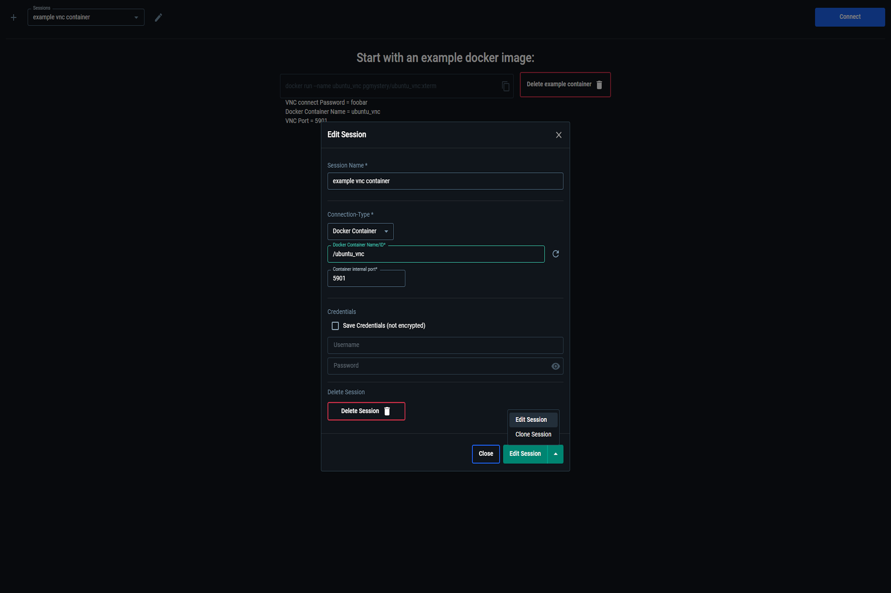

# 🐳 Docker Extension: [VNC Viewer](https://hub.docker.com/extensions/pgmystery/docker-extension-vnc) 🖥️

A [Docker Desktop Extension](https://www.docker.com/products/extensions/) that allows you to connect to VNC servers running inside Docker containers or on remote hosts — directly from [Docker Desktop](https://www.docker.com/products/docker-desktop/).

---

## 📚 Table of Contents

- [Overview](#-overview)
- [Features](#-key-features)
- [What You Can Do](#-what-you-can-do)
- [Why Use This Extension](#-why-use-this-extension)
- [Installation](#-installation)
    - [Install from Docker Marketplace](#-install-from-docker-marketplace)
    - [Manual Installation](#-manual-installation)
- [Usage](#-usage)
    - [Try the Example Container](#-try-the-example-container)
    - [Working with Sessions](#-working-with-sessions)
        - [Connect to a Docker Container](#-connect-to-a-docker-container)
        - [Run from a Docker Image](#-run-from-a-docker-image)
        - [Connect to a Remote Host](#-connect-to-a-remote-host)

---

## 🧭 Overview

This Docker Desktop Extension creates a temporary proxy container using [noVNC](https://github.com/novnc/noVNC), giving you browser-based access to any VNC server — whether it's inside another container or running on a remote host.

### 🔑 Key Features

- Connect to Docker containers, images, or remote VNC servers
- Automatic Docker networking and cleanup
- Secure session management with persistent storage
- Includes pre-built environments:
    - [Xfce](/docker/vnc_ubuntu/xfce)
    - [Cinnamon](/docker/vnc_ubuntu/cinnamon)
    - [MATE](/docker/vnc_ubuntu/mate)
    - [KDE-Plasma](/docker/vnc_ubuntu/kde-plasma)
    - [LXDE](/docker/vnc_ubuntu/lxde)
    - [LXQT](/docker/vnc_ubuntu/lxqt)
    - [xTerm](/docker/vnc_ubuntu/xterm)

---

## 🚀 What You Can Do

### 🖥️ Run GUI-Based Linux Applications

Launch popular apps without installing anything on your host:

- Browsers (Firefox, Chromium)
- Editors (VS Code, LibreOffice)
- Tools (GIMP, PDF viewers)

And many more...

    ✔️ Ideal for isolated, disposable environments. Ideal for temporary, sandboxed tasks without cluttering your OS.

### 🌐 Web Dev & Browser Testing

Spin up clean browser instances in seconds for testing login flows, UI layouts, or performance.

    💡 Use multiple containers for parallel testing.


### 🤖 Selenium Testing

Try our ready-to-use Selenium testing example:

1. Navigate to the [/examples/selenium](/examples/selenium) directory
2. Follow the step-by-step guide in the README file to:
    - Set up a Selenium Chrome container
    - Run automated browser tests
    - Watch the tests execute in real-time


    🔍 Perfect for visual debugging of Selenium test suites

### 🔬 Malware or File Analysis (Safely)

Open suspicious files in an isolated Linux environment.

    🔒 Just close the container to dispose of everything.

### 🛠️ GUI Debugging in Containers

Run GUI debuggers or desktop editors inside a container.

    💻 Perfect for debugging GUI-based apps or editors (e.g. GDB GUI, VS Code Desktop) without leaving Docker.

### 📦 Legacy Software in CI/CD

Use GUI-reliant tools in headless pipelines.

    🔁 Ideal for automated PDF/image generation or GUI testing.

### 🎓 Disposable Desktops for Training

Provide ready-to-use Linux desktops for workshops, demos, or internal labs.

    🎓 Great for teaching Linux, Docker, or OSS tools.

---

## ✨ Why Use This Extension?

- ✅ **Zero Setup** – Just launch from Docker Desktop
- 📦 **Fully Containerized** – Nothing installed on the host
- 🔒 **Safe & Isolated** – Perfect for testing risky files
- 🔧 **Customizable** – Add your own Dockerfiles and tools

---

## 🔧 Installation

### 📥 Install from Docker Marketplace

> 👉 [Click here to install via Docker Desktop Marketplace](https://open.docker.com/extensions/marketplace?extensionId=pgmystery/docker-extension-vnc)

### 🛠️ Manual Installation

```bash
docker extension install pgmystery/docker-extension-vnc:1.3.3
```

---

## 🧪 Usage

### ▶️ Try the Example Container

Click the **"Try example container"** button to launch a prebuilt [Ubuntu VNC image](https://hub.docker.com/r/pgmystery/ubuntu_vnc) with a desktop environment.


---

### 🗂 Working with Sessions

Sessions allow you to save and manage connection presets. Stored securely in a Docker volume via a backend container using SQLite.

To create a session:
1. Click the ➕ icon
2. Fill out the form
3. Save and click **Connect**

Supported connection types:
- [Docker Container](#-connect-to-a-docker-container)
- [Docker Image](#-run-from-a-docker-image)
- [Remote Host](#-connect-to-a-remote-host)



---

#### 🐳 Connect to a Docker Container

1. Create a new session
2. Select **Docker Container**
3. Choose a running container or enter its name/ID
4. Set the internal VNC port
5. (Optional) Enter credentials
6. Save and connect


---

#### 📦 Run from a Docker Image

1. Enter a unique Session name.
2. Choose **Docker Image** as the connection type.
3. Select a VNC-enabled Docker Image from the Docker-Hub or locally (e.g. [`selenium/standalone-chrome-debug`](https://hub.docker.com/r/selenium/standalone-chrome-debug)).
4. Select the image tag.
5. (*Optional*) Add [Docker Run Options](https://docs.docker.com/reference/cli/docker/container/run/#options).
6. (*Optional*) Specify a custom [Docker Run command with Args](https://docs.docker.com/engine/containers/run/#commands-and-arguments).
7. Specify the VNC-Server port.
8. Choose whether to remove the Container after disconnecting or keep it alive.
9. (*Optional*) Enter the credentials for the VNC connection if you want to store them.
10. Save and connect

---

#### 🌍 Connect to a Remote Host

1. Enter a unique Session name.
2. Choose **Remote Host** as the connection type.
3. Enter the IP-Address of the remote host.
4. Specify the VNC-Server port.
5. (*Optional*) Enter the credentials for the VNC connection if you want to store them.
6. Save and connect

Supports Linux, macOS, and Windows hosts.


---

## 📎 Related Links

- [Docker Extension on Docker Hub](https://hub.docker.com/extensions/pgmystery/docker-extension-vnc)
- [Example Ubuntu VNC Image](https://hub.docker.com/r/pgmystery/ubuntu_vnc)
- [noVNC GitHub](https://github.com/novnc/noVNC)
- [Proxy Container](https://hub.docker.com/r/pgmystery/proxy_vnc)
