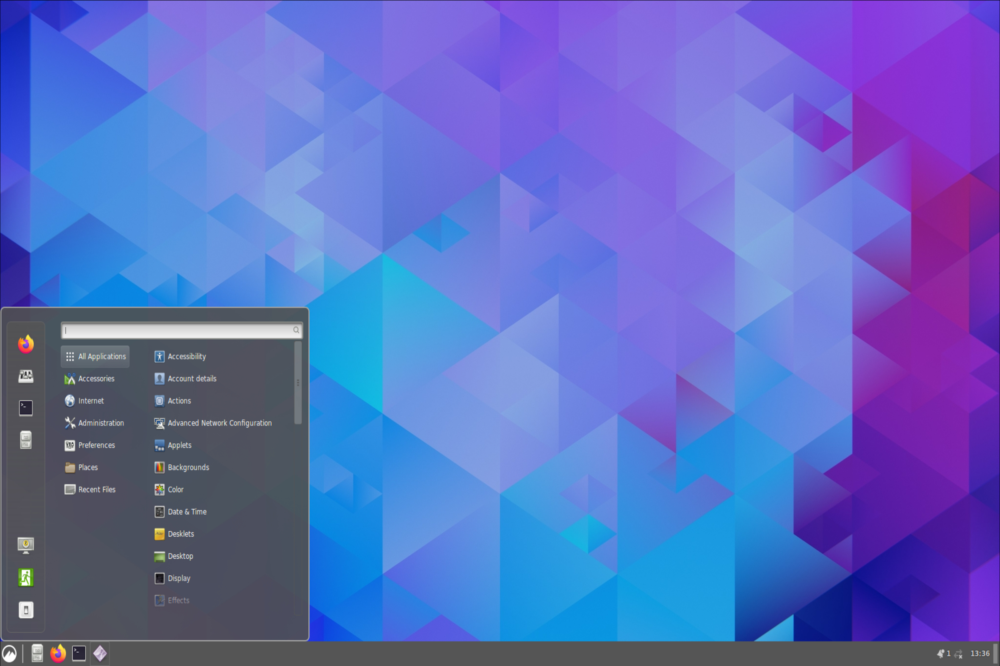

# Ubuntu VNC Desktop/Server

## [Cinnamon](https://en.wikipedia.org/wiki/Cinnamon_(desktop_environment))

## Description

This Docker Image is part of the project [docker-extension-vnc](https://github.com/pgmystery/docker-extension-vnc).

## Environment Variables

| Environment-Variable | Default      | Description                                     |
|---------------------|--------------|-------------------------------------------------|
| `VNC_PASSWORD`      | foobar       | Set the VNC Server password.                    |
| `PORT`              | 5901         | Set the internal expose port of the VNC Server. |
| `RESOLUTION`        | 1920x1080    | The resolution of the Desktop.                  |
| `LANG`              | en_US.UTF-8  | The environment language.                       |

## Knowing Issues
- The Desktop don't show any icons and is not interactable.

## Screenshot

